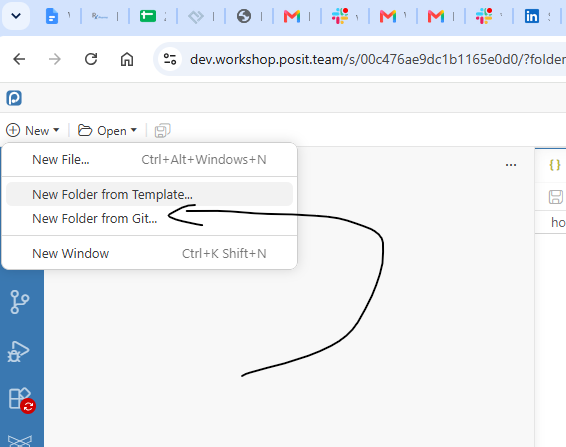

# Environment Setup

Get your environment ready before the first exercise block. This takes about 5 minutes. The notebooks are standard 
`.ipynb` files, so you have several options for creating an environment for completing the workshop. 

## Prerequisites

- **Python 3.10 or later** (3.12 recommended). Check with `python --version` (on some systems `python3 --version`).
- **git** to clone the workshop repository.

## Setup instructions to use Posit Workbench

### Login Instructions:
1. Go to [workshop.posit.team](https://workshop.posit.team/). 
2. Click Sign in with OpenID and select New user? Register (make sure to include your first name and last initial), OR click Sign in to GitHub.

### Launching Positron:
1. In Workbench, select New Session.
2. Click on Positron
3. In the Image Options dropdown, just select the default image.
4. Leave all other defaults as they are.
5. Click Start Session.
6. Select `New`, then `New Folder from Git...`, then enter the class repo: `https://github.com/swhume/r-pharma-odmlib`

7. Open a terminal in Positron (**Terminal → New Terminal**) and, from the repo folder, install the workshop dependencies:

   ```bash
   pip install -r requirements.txt
   ```



### Helpful Notes & Shortcuts:
- When setting up, remember to launch a folder for AI.
- Ctrl+Shift+P: Opens the Command Palette
- Color Theme: Can be adjusted via the Command Palette
- !Reload Window: Use this command if you need to refresh your view

### AI Usage Guidelines 
Posit Workbench has Bedrock and AI tools available. When using these features, please select the Anthropic Claude 
Sonnet model. While we encourage you to take advantage of the AI and the environment, please be cautious about overall 
usage limits and ensure students know these sessions will NOT persist after the workshop.

## Setup steps to use Jupyter Lab

Run these commands in a terminal:

```bash
# 1. Clone the workshop repository
git clone https://github.com/swhume/r-pharma-odmlib.git
cd r-pharma-odmlib

# 2. Create and activate a virtual environment
python -m venv .venv
source .venv/bin/activate          # macOS / Linux
# .venv\Scripts\activate           # Windows (PowerShell: .venv\Scripts\Activate.ps1)

# 3. Install the workshop dependencies
pip install -r requirements.txt

# 4. Start JupyterLab
jupyter lab
```
python -m pip install --upgrade pip

JupyterLab opens in your browser. In the file browser on the left, open `00_setup/verify_setup.ipynb` and run all cells (menu: **Run → Run All Cells**). If the final cell prints a success message, you are ready for Block 1.

## Alternatives Setup Options

The notebooks are standard `.ipynb` files, so if you prefer another editor you can use it instead:

- **VS Code**: install the *Python* and *Jupyter* extensions, open the repo folder, and select the `.venv` interpreter as the notebook kernel.
- **PyCharm** (Professional): open the repo as a project with `.venv` as the interpreter and open the notebooks directly.
- **Google Colab**: Another online alternative for running Jupyter Notebooks.

The workshop is presented using Positron in Posit Workbench, but any environment that runs Python Jupyter Notebooks
should work fine.

## Troubleshooting

- **`python: command not found`** — try `python3` (and `python3 -m venv .venv`).
- **Windows: "running scripts is disabled"** when activating — run `Set-ExecutionPolicy -Scope CurrentUser RemoteSigned` in PowerShell once, then activate again.
- **Corporate proxy / SSL errors during pip install** — try `pip install --trusted-host pypi.org --trusted-host files.pythonhosted.org -r requirements.txt`, or ask your IT group for the proxy settings (`pip install --proxy http://...`).
- **`jupyter: command not found`** — make sure the virtual environment is activated (your prompt should show `(.venv)`).
- **Wrong odmlib version** — `pip show odmlib` should report 0.2.1 or later. If not: `pip install --upgrade odmlib`.

## What gets installed

| Package | Why |
|---------|-----|
| `odmlib` | The library this workshop is about — schema-aware Python models for CDISC ODM, Define-XML, Dataset-JSON, and ARM |
| `defineutils` | Command-line Define-XML utilities built on odmlib (used in the tools demo) |
| `jupyterlab` | The notebook environment |
